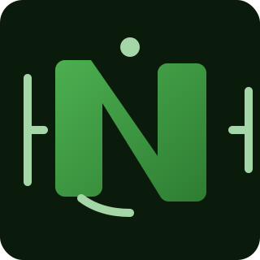

# Neo N3 NEF Inspector

<p align="center">
  
</p>

[](https://github.com/r3e-network/neo-decompiler/actions/workflows/ci.yml)
[](https://crates.io/crates/neo-decompiler)
[](https://docs.rs/neo-decompiler)
[](#license)
[](https://github.com/r3e-network/neo-decompiler/releases/latest)

This project provides a small, well-tested Rust crate and CLI for inspecting
Neo N3 NEF bytecode packages. It focuses on the essential pieces that are easy
to run locally: parsing the NEF container (header, method tokens, checksum),
loading the companion contract manifest, decoding a useful slice of Neo VM
opcodes, and rendering both pseudocode and a high-level contract skeleton.

## Supported Features

### Binary Format Analysis

| Feature                 | Status | Description                                                        |
| ----------------------- | ------ | ------------------------------------------------------------------ |
| NEF Container Parsing   | ✅     | Magic bytes, compiler metadata, source hash, checksum verification |
| Script Hash Calculation | ✅     | Hash160 (RIPEMD160(SHA256)) in little-endian and canonical forms   |
| Method Token Decoding   | ✅     | Variable-length encoding with call flag validation                 |
| Checksum Verification   | ✅     | Double SHA-256 integrity check per Neo specification               |
| Manifest Parsing        | ✅     | Full ABI, permissions, trusts, groups, features extraction         |

### Disassembly Engine

| Feature                  | Status | Description                                                         |
| ------------------------ | ------ | ------------------------------------------------------------------- |
| Linear Sweep Disassembly | ✅     | Sequential instruction decoding with operand extraction             |
| Opcode Coverage          | ✅     | 160+ Neo VM opcodes from upstream `OpCode.cs`                       |
| Operand Decoding         | ✅     | I8/I16/I32/I64, variable-length bytes, jump targets, syscall hashes |
| Unknown Opcode Handling  | ✅     | Tolerant mode (comments) or strict mode (fail-fast)                 |
| Syscall Resolution       | ✅     | 50+ syscalls with handler names, prices, call flags                 |
| Native Contract Binding  | ✅     | GasToken, NeoToken, ContractManagement, etc. method resolution      |

### Decompilation Pipeline

| Feature                       | Status | Description                                         |
| ----------------------------- | ------ | --------------------------------------------------- |
| Stack Simulation              | ✅     | Abstract interpretation of stack operations         |
| Expression Building           | ✅     | Stack values lifted to infix expressions            |
| Temporary Variable Generation | ✅     | Automatic naming for intermediate values            |
| Constant Propagation          | ✅     | Literal tracking through stack operations           |
| Void Syscall Detection        | ✅     | Suppress phantom return values for known void calls |

### Control Flow Recovery

| Feature              | Status | Description                                       |
| -------------------- | ------ | ------------------------------------------------- |
| Conditional Branches | ✅     | `if`/`else` block reconstruction                  |
| Pre-test Loops       | ✅     | `while` loop pattern detection                    |
| Post-test Loops      | ✅     | `do { } while` loop pattern detection             |
| Counting Loops       | ✅     | `for` loop reconstruction with iterator detection |
| Loop Exit Statements | ✅     | `break`/`continue` emission at correct scope      |
| Exception Handling   | ✅     | `try`/`catch`/`finally` block reconstruction      |
| Jump Target Analysis | ✅     | Forward/backward branch classification            |

### Slot & Variable Analysis

| Feature                  | Status | Description                                         |
| ------------------------ | ------ | --------------------------------------------------- |
| Local Slot Tracking      | ✅     | `STLOC`/`LDLOC` mapped to `local_N` identifiers     |
| Argument Slot Tracking   | ✅     | `STARG`/`LDARG` mapped to `arg_N` or manifest names |
| Static Slot Tracking     | ✅     | `STSFLD`/`LDSFLD` mapped to `static_N` identifiers  |
| Manifest Parameter Names | ✅     | ABI parameter names applied to argument slots       |
| Initialization Detection | ✅     | First-write tracking for declaration placement      |

### Output Formats

| Feature         | Status | Description                                                |
| --------------- | ------ | ---------------------------------------------------------- |
| Pseudocode      | ✅     | Linear instruction listing with resolved operands          |
| High-Level View | ✅     | Structured code with control flow and expressions          |
| C# Skeleton     | ✅     | Compilable stub with attributes, events, method signatures |
| JSON Reports    | ✅     | Machine-readable output with JSON Schema validation        |
| Text Reports    | ✅     | Human-readable formatted output                            |

### Security & Robustness

| Feature                     | Status | Description                                    |
| --------------------------- | ------ | ---------------------------------------------- |
| Input Size Limits           | ✅     | 10 MiB file limit, 1 MiB operand limit         |
| Integer Overflow Protection | ✅     | Checked arithmetic in slice operations         |
| Malformed Input Handling    | ✅     | Graceful error reporting, no panics            |
| Fuzz Testing                | ✅     | cargo-fuzz targets for parser and disassembler |

---

## Roadmap

### Planned Features (v0.3.x)

| Feature                   | Priority | Description                                             |
| ------------------------- | -------- | ------------------------------------------------------- |
| Control Flow Graph (CFG)  | High     | Explicit basic block graph with edges for visualization |
| Else-If Chain Detection   | High     | Collapse nested `if`/`else` into `else if` chains       |
| Dead Code Detection       | Medium   | Identify unreachable basic blocks post-CFG construction |
| Expression Simplification | Medium   | Algebraic simplification (e.g., `x + 0` → `x`)          |
| Inline Expansion          | Medium   | Inline single-use temporaries into parent expressions   |

### Planned Features (v0.4.x)

| Feature                   | Priority | Description                                               |
| ------------------------- | -------- | --------------------------------------------------------- |
| Type Inference            | High     | Infer primitive types from opcodes and syscall signatures |
| Array/Map Type Recovery   | High     | Detect collection types from `PACK`/`NEWARRAY`/`NEWMAP`   |
| Call Graph Construction   | Medium   | Inter-procedural call relationships                       |
| Cross-Reference Analysis  | Medium   | Track where values are defined and used                   |
| Switch Statement Recovery | Medium   | Pattern-match jump tables to `switch`/`case`              |

### Planned Features (v0.5.x+)

| Feature               | Priority | Description                                         |
| --------------------- | -------- | --------------------------------------------------- |
| SSA Transformation    | Medium   | Static Single Assignment form for advanced analysis |
| Data Flow Analysis    | Medium   | Reaching definitions, live variable analysis        |
| Struct/Class Recovery | Low      | Infer composite types from field access patterns    |
| Deobfuscation Passes  | Low      | Detect and simplify common obfuscation patterns     |
| Interactive Mode      | Low      | REPL for exploratory analysis                       |
| Plugin Architecture   | Low      | User-defined analysis passes                        |

### Not Planned (Out of Scope)

| Feature                         | Reason                                                         |
| ------------------------------- | -------------------------------------------------------------- |
| Full Type System Reconstruction | Requires source-level type information not present in bytecode |
| Automatic Variable Naming       | Semantic naming requires ML/heuristics beyond current scope    |
| Source-Level Debugging          | Would require debug symbol format specification                |
| Contract Modification/Patching  | Tool is read-only by design                                    |

---

## What you get

- NEF header parsing (magic, compiler, version, script length, checksum)
- Script hash calculation (Hash160) exposed in both little-endian and canonical forms
- Method token decoding using the official variable-length encoding
- Opcode metadata generated from the upstream Neo VM source (unknown mnemonics
  fall back to informative comments, and new opcodes can be added via
  `tools/generate_opcodes.py`)
- Manifest parsing (`.manifest.json`) with ABI, feature, group, permission, and trust details that surface in both text and JSON outputs
- Disassembly for common opcodes such as `PUSH*`, arithmetic operations, jumps,
  calls, and `SYSCALL` (tolerant by default; optional fail-fast flag for unknown
  opcodes)
- Syscall metadata resolution with human-readable names, call flags, and return
  arity (void syscalls avoid phantom temporaries in the high-level view)
- Native contract lookup so method tokens can be paired with contract names
- High-level contract view that surfaces manifest ABI data, names locals/args
  via slot instructions (including manifest parameter names), and lifts stack
  operations into readable statements with structured `if`/`else`, `for`,
  `while`, `do { } while`, and `try`/`catch`/`finally` blocks plus emitted `break`/`continue`
  statements and manifest-derived signatures. When ABI offsets are present,
  each manifest method is decompiled within its own offset range; methods
  without offsets are still emitted as stubs for completeness.
- Syscall lifting that resolves human-readable names and suppresses phantom
  temporaries for known void syscalls (e.g., Runtime.Notify, Storage.Put)
- A simple pseudocode view mirroring the decoded instruction stream
- A C# contract skeleton view (`--format csharp`) that mirrors the manifest
  entry point, emits stubs for additional ABI methods, declares ABI events,
  and adds `[DisplayName]`/`[Safe]` attributes when available
- A single binary (`neo-decompiler`) and a reusable library (`neo_decompiler`)

## Quick start

```bash
# Build the binary
cargo build --release

# Print header information
./target/release/neo-decompiler info path/to/contract.nef

# Emit machine-readable header information (includes checksum, script hash, ABI, tokens, manifest path)
./target/release/neo-decompiler info --format json path/to/contract.nef

# Decode instructions
./target/release/neo-decompiler disasm path/to/contract.nef

# Fail fast on unknown opcodes (default is tolerant)
./target/release/neo-decompiler disasm --fail-on-unknown-opcodes path/to/contract.nef

# Machine-readable disassembly (tolerant by default)
./target/release/neo-decompiler disasm --format json path/to/contract.nef

# Emit the high-level contract view (auto-detects `*.manifest.json` if present)
./target/release/neo-decompiler decompile path/to/contract.nef

# Fail fast on unknown opcodes during high-level reconstruction
./target/release/neo-decompiler decompile --fail-on-unknown-opcodes path/to/contract.nef

# Emit the legacy pseudocode listing
./target/release/neo-decompiler decompile --format pseudocode path/to/contract.nef

# Emit a C# contract skeleton (includes manifest extras like Author/Email when present)
./target/release/neo-decompiler decompile --format csharp path/to/contract.nef

# Machine-readable decompilation (high-level, pseudocode, manifest path, metadata)
./target/release/neo-decompiler decompile --format json path/to/contract.nef

# Inspect method tokens
./target/release/neo-decompiler tokens path/to/contract.nef

# Machine-readable tokens listing
./target/release/neo-decompiler tokens --format json path/to/contract.nef

# Use --json-compact alongside any JSON format to minimise whitespace
./target/release/neo-decompiler info --format json --json-compact path/to/contract.nef
```

### Permissions example

Given a manifest snippet:

```json
{
  "permissions": [
    { "contract": { "hash": "0x0123..." }, "methods": ["symbol"] },
    { "contract": { "group": "03ABCD..." }, "methods": "*" }
  ],
  "trusts": "*"
}
```

The `info` command prints:

```
Permissions:
    - contract=hash:0x0123... methods=["symbol"]
    - contract=group:03ABCD... methods=*
Trusts: *
```

Corresponding JSON (truncated) mirrors the schema:

```json
"manifest": {
  "permissions": [
    {
      "contract": { "type": "Hash", "value": "0x0123..." },
      "methods": { "type": "Methods", "value": ["symbol"] }
    },
    {
      "contract": { "type": "Group", "value": "03ABCD..." },
      "methods": { "type": "Wildcard", "value": "*" }
    }
  ],
  "trusts": { "type": "Wildcard", "value": "*" }
}
```

## Worked example (nccs)

The repository ships with a minimal C# contract under
[`examples/hello_world`](examples/hello_world/HelloWorld.cs). You can compile it
with the official Neo C# compiler (`nccs`) and immediately feed the result into
the decompiler:

```bash
# Install the Neo compiler if you do not already have it
dotnet tool install -g Neo.Compiler.CSharp

# Compile the example contract
nccs compile \
  examples/hello_world/HelloWorld.cs \
  --nef build/HelloWorld.nef \
  --manifest build/HelloWorld.manifest.json

# Decompile (auto-detects the manifest sitting next to the NEF)
neo-decompiler decompile build/HelloWorld.nef
```

The `examples/README.md` file explains the walkthrough and can serve as a
starting point for your own experiments.

## Installation

### From crates.io (recommended)

```bash
cargo install neo-decompiler
```

### From GitHub releases

Download pre-built binaries from the [releases page](https://github.com/r3e-network/neo-decompiler/releases/latest).

### From source

```bash
# Install the latest release from git
cargo install --git https://github.com/r3e-network/neo-decompiler --tag v0.2.0 --locked

# Or install the latest development version
cargo install --git https://github.com/r3e-network/neo-decompiler --locked

# Or install locally from a checkout
cargo install --path . --locked
```

## Library example

The crate ships with the CLI enabled by default. If you only need the library
APIs and want to avoid pulling in CLI-only dependencies, disable default
features in your `Cargo.toml`:

```toml
neo-decompiler = { version = "0.2.0", default-features = false }
```

```rust
use neo_decompiler::{Decompiler, OutputFormat};

fn main() -> Result<(), Box<dyn std::error::Error>> {
    let decompiler = Decompiler::new();
    let result = decompiler.decompile_file_with_manifest(
        "contract.nef",
        Some("contract.manifest.json"),
        OutputFormat::All,
    )?;

    println!("{} instructions", result.instructions.len());
    if let Some(ref hl) = result.high_level {
        println!("{}", hl);
    }
    Ok(())
}
```

`contract.type` is `Hash` for explicit script hashes, `Group` for public-key groups,
and `Wildcard` when `*` is specified. `methods.type` mirrors the same wildcard vs list
semantics (e.g., `Methods` with `value: ["symbol"]`).

### Built-in metadata coverage

All published Neo N3 opcodes, syscalls, and native contracts are bundled with the
crate so there is no network or tooling dependency at runtime:

- `src/opcodes_generated.rs` is produced by `tools/generate_opcodes.py`, which
  scrapes the upstream `OpCode.cs` file and emits every mnemonic alongside its
  byte value and operand encoding.
- `src/syscalls_generated.rs` originates from `tools/data/syscalls.json` and
  lists each syscall hash, its friendly name, handler, price, and call-flag
  mask. `crate::syscalls::lookup` wires this table into the disassembler and
  high-level view so every `SYSCALL` shows human-readable context.
- `src/native_contracts_generated.rs` is generated from
  `tools/data/native_contracts.json` and enumerates every native contract hash
  plus its publicly-exposed methods, ensuring method tokens are annotated with
  canonical names when possible.

Re-run the scripts in `tools/` whenever Neo introduces new entries. Each script
overwrites the corresponding generated Rust file, so `git status` immediately
highlights the delta and the expanded coverage is propagated to the CLI and
library APIs.

Use the CLI to browse these tables directly:

```
# List all syscalls with hashes, handlers, and call flags
neo-decompiler catalog syscalls

# Machine-readable native-contract catalog
neo-decompiler catalog native-contracts --format json

# Enumerate every opcode and operand encoding
neo-decompiler catalog opcodes
```

## Testing artifacts

- Drop real contracts anywhere under `TestingArtifacts/` to extend coverage:
  - C# source with embedded manifest/NEF blobs (`*.cs`) are parsed and rewritten into `TestingArtifacts/decompiled/<relative>/`.
  - Paired files (`Example.nef` + `Example.manifest.json`) are also picked up automatically (recursively).
- Known limitations can be listed in `TestingArtifacts/known_unsupported.txt` (one name per line, `#` for comments, optional `path:expected substring` to assert the error text); matching artifacts are allowed to fail and are copied to `*.error.txt`.
- Outputs mirror the artifact layout under `TestingArtifacts/decompiled/`, which is git-ignored by default. Known-unsupported entries are still processed and must emit a non-empty `*.error.txt` to document the failure reason.
- Current samples ship under `TestingArtifacts/edgecases/` (loop lifting, method tokens, manifest metadata, permissions/trusts, call-flag failure, events) and `TestingArtifacts/embedded/` (compiler-style C# with embedded manifest/NEF).

### Extending opcode coverage

The high-level view prints informative comments for opcodes that are not yet lifted
into structured statements (`// XXXX: <MNEMONIC> (not yet translated)`).

- If Neo adds new opcodes, regenerate `src/opcodes_generated.rs` via
  `tools/generate_opcodes.py` (requires `tools/OpCode.cs` from the upstream
  Neo project) and update the disassembler as needed.
- If you want to improve high-level lifting for existing opcodes, add handling
  in `src/decompiler/high_level/emitter/dispatch.rs` (and related helpers under
  `src/decompiler/high_level/emitter/`), then extend the unit tests under
  `src/decompiler/tests/`.

## Scope and limitations

- NEF checksums are verified using the same double-SHA256 calculation employed
  by the official toolchain. Files with mismatching checksums are rejected.
- The disassembler covers the opcodes exercised by our tests (including the
  various `PUSH*` forms, short/long jumps, calls, and `SYSCALL`). Unrecognised
  opcodes still produce informative comments so you can decide how to extend the
  decoder.
- The high-level contract view (and the derived C# skeleton) performs
  lightweight stack lifting (constants, arithmetic, simple returns, syscalls)
  and recognises structured control flow such as `if`/`else`, `for`, `while`,
  and `do { } while` loops (including `break`/`continue` branches). Complex reconstruction
  such as full control-flow graphs or type inference is intentionally out of
  scope.

## Troubleshooting

- **"manifest not provided" in JSON/text output** – ensure the `.manifest.json`
  file sits next to the NEF or pass it explicitly via `--manifest path/to/file`.
- **Manifest path missing in text/JSON output** – both views show the detected
  path (look for `Manifest path:` in text, or `manifest_path` in JSON). If it is
  absent/`null`, pass `--manifest path/to/contract.manifest.json` explicitly.
- **Checksum mismatch errors** – the CLI re-computes the NEF hash; re-build the
  contract to regenerate the NEF or verify you are pointing at the correct file.
- **Unsupported opcode warnings** – the disassembler prints comments for
  unrecognised instructions; add tests and extend `opcodes_generated.rs` if you
  observe new opcodes.
- **Need structured data for scripting** – use the `--format json` variants
  (`info`, `disasm`, `tokens`, `decompile`) and add `--json-compact` when piping
  into tools that prefer minified payloads. If you need the manifest path or
  operand types, consume the structured fields exposed in the JSON report
  (`manifest_path`, `operand_kind`, `operand_value`).
- **Unexpected native-contract warnings** – the CLI resolves method tokens to
  native hashes; when you see `native contract ... does not expose method ...`,
  double-check the target contract name or regenerate the NEF to ensure the
  method token is valid. (These also appear in the JSON `warnings` array; other
  warning types may be added in the future.)

### JSON schema overview

Each `--format json` command emits a top-level object containing:

- `file`: Path to the NEF file being inspected.
- `manifest_path`: Optional path to the manifest file that was consumed.
- `warnings`: Array of human-readable warnings (currently populated when method
  tokens refer to unknown native methods).
- Command-specific payloads:
  - `info`: checksum, script hashes, `method_tokens` (with native annotations)
    and `manifest` summaries (methods, events, permissions, trusts).
  - `disasm`: `instructions` array with `offset`, `opcode`, `operand_kind`, and
    structured `operand_value`.
  - `decompile`: combines the disassembly, `high_level` text, `csharp` view,
    `pseudocode`, and `method_tokens` into one report (C# view carries
    manifest extras such as Author/Email when provided).
  - `tokens`: standalone `method_tokens` array for quick inspection.

Example (excerpt from `info --format json`):

```json
{
  "file": "path/to/contract.nef",
  "manifest_path": "path/to/contract.manifest.json",
  "manifest": {
    "groups": [
      {
        "pubkey": "03ab...ef",
        "signature": "00ff..."
      }
    ],
    "permissions": [
      {
        "contract": { "type": "Hash", "value": "0x0123..." },
        "methods": { "type": "Methods", "value": ["symbol"] }
      }
    ],
    "trusts": { "type": "Contracts", "value": ["0x89ab..."] }
  },
  "method_tokens": [
    {
      "method": "Transfer",
      "native_contract": {
        "contract": "GasToken",
        "label": "GasToken::Transfer"
      }
    }
  ],
  "warnings": []
}
```

Formal schema files live under [`docs/schema`](docs/schema) for every JSON command
(`info.schema.json`, `disasm.schema.json`, `decompile.schema.json`, `tokens.schema.json`).
See [`docs/schema/README.md`](docs/schema/README.md) for versioning guarantees,
validation instructions, and per-command details. Use
`neo-decompiler schema --list` to discover the available schemas (with version
and description; use `--list-json` for paths), and
`neo-decompiler schema <info|disasm|decompile|tokens>` (optionally with
`--json-compact`, `--output schema.json`, or `--quiet`) to print or persist
them without cloning the repository.

To validate an existing JSON report:

```bash
neo-decompiler info --format json contract.nef > info.json
neo-decompiler schema info --validate info.json
# or pipe via stdin (suppress schema body with --quiet / --no-print)
neo-decompiler schema info --validate - --quiet < info.json
```

## Development

```bash
cargo fmt
cargo test
```

If you use [`just`](https://github.com/casey/just), the repository ships with a
`Justfile` providing shortcuts for the common workflows above.

Issues and pull requests are welcome if they keep the project lean and focused.

## Contributing

See [`CONTRIBUTING.md`](CONTRIBUTING.md) for development guidelines and
[`CODE_OF_CONDUCT.md`](CODE_OF_CONDUCT.md) for behavioural expectations.

## Support & Security

- Support channels are documented in [`SUPPORT.md`](SUPPORT.md).
- Responsible disclosure guidance lives in [`SECURITY.md`](SECURITY.md).

## Changelog

Recent project history is tracked in [`CHANGELOG.md`](CHANGELOG.md).

**Current version:** [v0.2.0](https://github.com/r3e-network/neo-decompiler/releases/tag/v0.2.0) (2025-12-13)

## Minimum supported Rust version

The crate is tested against Rust `1.70` and newer on CI. Older toolchains are
not guaranteed to work.

## License

Dual licensed under MIT or Apache-2.0.
See `LICENSE-MIT` and `LICENSE-APACHE` for details.
